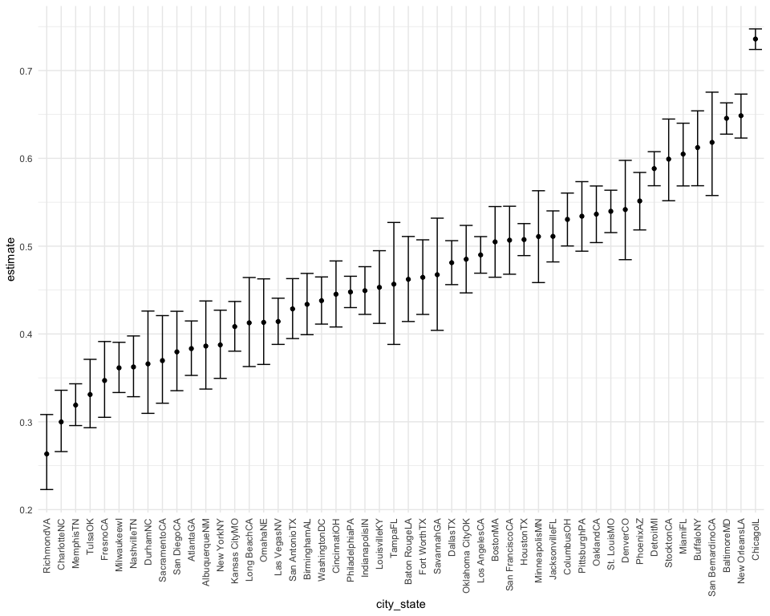
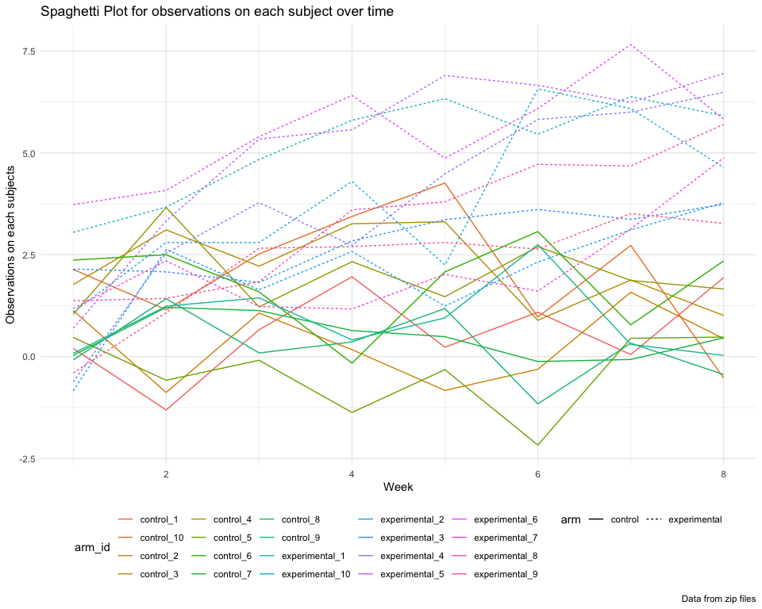

P8105 HW5
================
Shihui Zhu sz3029

## Problem 1

### Describe the raw data

``` r
homicides <- 
  read_csv("data/homicide-data.csv", na = c("", "Unkown")) %>%
  # create a citystate variable
  mutate(
    city_state = str_c(city, state),
    resolution = case_when(
      disposition == "Closed without arrest" ~ "unsolved",
      disposition == "Open/No arrest"        ~ "unsolved",
      disposition == "Closed by arrest"     ~ "solved"
      )
    ) %>%
  relocate(city_state) %>%
  # exclude the wrong issue
  filter(city_state != "TulsaAL")
```

There is a data-entry issue for the city Tulsa. This needs to be fixed
in the raw dataset so we just ignore it for now.

Summarize within cities to obtain the total number of homicides and the
number of unsolved homicides

``` r
homicides %>%
  group_by(city_state) %>%
  summarise(
    unsolved = sum(resolution == "unsolved"),
    total = n()
  ) #%>%
```

    ## # A tibble: 50 × 3
    ##    city_state    unsolved total
    ##    <chr>            <int> <int>
    ##  1 AlbuquerqueNM      146   378
    ##  2 AtlantaGA          373   973
    ##  3 BaltimoreMD       1825  2827
    ##  4 Baton RougeLA      196   424
    ##  5 BirminghamAL       347   800
    ##  6 BostonMA           310   614
    ##  7 BuffaloNY          319   521
    ##  8 CharlotteNC        206   687
    ##  9 ChicagoIL         4073  5535
    ## 10 CincinnatiOH       309   694
    ## # … with 40 more rows

``` r
  #mutate(
    #test_results = map2(unsolved, n, prop.test),
    #tidy_results = map(test_results, broom::tidy)
  #) %>%
  #select(city_state, tidy_results) %>%
  #unnest(tidy_results) %>%
  #select(city_state, estimate, starts_with("conf"))
```

### Let’s focus on Baltimore, MD.

``` r
baltimore_df <-
  homicides %>%
  filter(city_state == "BaltimoreMD")

baltimore_summary <-
  baltimore_df %>%
    summarize(
      unsolved = sum(resolution == "unsolved"),
      n = n()
    )

baltimore_test <-
  prop.test(
    x = baltimore_summary %>% pull(unsolved),
    n = baltimore_summary %>% pull(n)
  )

# organize the test output as dataframe
baltimore_test %>%
  broom::tidy()
```

    ## # A tibble: 1 × 8
    ##   estimate statistic  p.value parameter conf.low conf.high method    alternative
    ##      <dbl>     <dbl>    <dbl>     <int>    <dbl>     <dbl> <chr>     <chr>      
    ## 1    0.646      239. 6.46e-54         1    0.628     0.663 1-sample… two.sided

### Let’s try to iterate across cities!

First off, write a function and test on sample cities.

``` r
prop_test_function = function(city_df) {
  
  city_summary <-
    city_df %>%
      summarize(
        unsolved = sum(resolution == "unsolved"),
        n = n()
    )

  city_test <-
    prop.test(
      x = city_summary %>% pull(unsolved),
      n = city_summary %>% pull(n)
    )
  
  return(city_test)
}

prop_test_function(baltimore_df)
```

    ## 
    ##  1-sample proportions test with continuity correction
    ## 
    ## data:  city_summary %>% pull(unsolved) out of city_summary %>% pull(n), null probability 0.5
    ## X-squared = 239.01, df = 1, p-value < 2.2e-16
    ## alternative hypothesis: true p is not equal to 0.5
    ## 95 percent confidence interval:
    ##  0.6275625 0.6631599
    ## sample estimates:
    ##         p 
    ## 0.6455607

``` r
homicides %>%
  filter(city_state == "AlbuquerqueNM") %>%
  prop_test_function()
```

    ## 
    ##  1-sample proportions test with continuity correction
    ## 
    ## data:  city_summary %>% pull(unsolved) out of city_summary %>% pull(n), null probability 0.5
    ## X-squared = 19.114, df = 1, p-value = 1.232e-05
    ## alternative hypothesis: true p is not equal to 0.5
    ## 95 percent confidence interval:
    ##  0.3372604 0.4375766
    ## sample estimates:
    ##         p 
    ## 0.3862434

### Now, let’s iterate across all cities

``` r
results_df <- 
  homicides %>%
  nest(data = uid:resolution) %>%
  mutate(
    test_results = map(data, prop_test_function),
    tidy_results = map(test_results, broom::tidy)
  ) %>%
  select(city_state, tidy_results) %>%
  unnest(tidy_results) %>%
  select(city_state, estimate, starts_with("conf"))
```

### Try to make a plot showing estimates and confidence intervals.

``` r
results_df %>%
  mutate(city_state = fct_reorder(city_state, estimate)) %>%
  ggplot(aes(x = city_state, y = estimate)) +
  geom_point() +
  geom_errorbar(aes(ymin = conf.low, ymax = conf.high)) +
  theme(axis.text.x = element_text(angle = 90, vjust = 0.5, hjust = 1))
```



## Problem 2

Start with a dataframe containing all file names via the `list.files`

``` r
zip_list <-
  tibble(
    files = list.files("data/zip_data/")
  )
```

Iterate over file names and read in data for each subject using
`purrr::map` and saving the result as a new variable in the dataframe

``` r
zip_df <-
  zip_list %>%
  mutate(
    files = str_c("data/zip_data/", files)
  ) %>%
  mutate(
    data = map(files, ~read_csv(.))
  )
```

Tidy the result

``` r
zip_tidy <-
  zip_df %>%
  mutate(
    files = str_replace(files, "data/zip_data/", ""),
    files = str_replace(files, ".csv", "")
  ) %>%
  unnest(data) %>%
  separate(files, c("arm", "id"), "_") %>%
  mutate(
    arm = ifelse(arm == "con", "control", "experimental")
  ) %>%
  pivot_longer(
    week_1:week_8,
    names_to = "week",
    names_prefix = "week_",
    values_to = "observations"
  ) %>%
  mutate(
    id = as.factor(as.numeric(id)),
    week = as.numeric(week)
  )
zip_tidy
```

    ## # A tibble: 160 × 4
    ##    arm     id     week observations
    ##    <chr>   <fct> <dbl>        <dbl>
    ##  1 control 1         1         0.2 
    ##  2 control 1         2        -1.31
    ##  3 control 1         3         0.66
    ##  4 control 1         4         1.96
    ##  5 control 1         5         0.23
    ##  6 control 1         6         1.09
    ##  7 control 1         7         0.05
    ##  8 control 1         8         1.94
    ##  9 control 2         1         1.13
    ## 10 control 2         2        -0.88
    ## # … with 150 more rows

Make a spaghetti plot showing observations on each subject over time

``` r
zip_tidy %>%
  mutate(
    arm_id = str_c(arm, "_", id)
  ) %>%
  ggplot(aes(x = week, y = observations, color = arm_id)) + 
  geom_line(aes(linetype = arm)) +
  labs(
    title = "Spaghetti Plot for observations on each subject over time",
    x = "Week",
    y = "Observations on each subjects",
    caption = "Data from zip files"
  ) + 
  scale_colour_hue()
```


From the spaghetti plot we observe that both arms have similar range of
observations at the start of week 1, but the experimental group ends up
with higher observation values compared with the control group at the
end of the study i.e. at week 8.

## Problem 3

### Fill in missing values for `iris` dataset

``` r
set.seed(10)

iris_with_missing = iris %>% 
  map_df(~replace(.x, sample(1:150, 20), NA)) %>%
  mutate(Species = as.character(Species))
```

Write a function for missing values.

``` r
fill_in_missing = function(vector) {
  # fill in missing values with the mean of non-missing values
  if (is.numeric(vector)) {
    vector = replace_na(vector, mean(vector, na.rm = TRUE))
  }
  # fill in missing values with "virginica"
  if (is.character(vector)) {
    vector = replace_na(vector, "virginica")
  }
  
  return(vector)
}
```

Apply the function column by column

``` r
iris_with_missing <-
  iris_with_missing %>%
  map(fill_in_missing)

bind_rows(iris_with_missing)
```

    ## # A tibble: 150 × 5
    ##    Sepal.Length Sepal.Width Petal.Length Petal.Width Species
    ##           <dbl>       <dbl>        <dbl>       <dbl> <chr>  
    ##  1         5.1          3.5         1.4         0.2  setosa 
    ##  2         4.9          3           1.4         0.2  setosa 
    ##  3         4.7          3.2         1.3         0.2  setosa 
    ##  4         4.6          3.1         1.5         1.19 setosa 
    ##  5         5            3.6         1.4         0.2  setosa 
    ##  6         5.4          3.9         1.7         0.4  setosa 
    ##  7         5.82         3.4         1.4         0.3  setosa 
    ##  8         5            3.4         1.5         0.2  setosa 
    ##  9         4.4          2.9         1.4         0.2  setosa 
    ## 10         4.9          3.1         3.77        0.1  setosa 
    ## # … with 140 more rows
